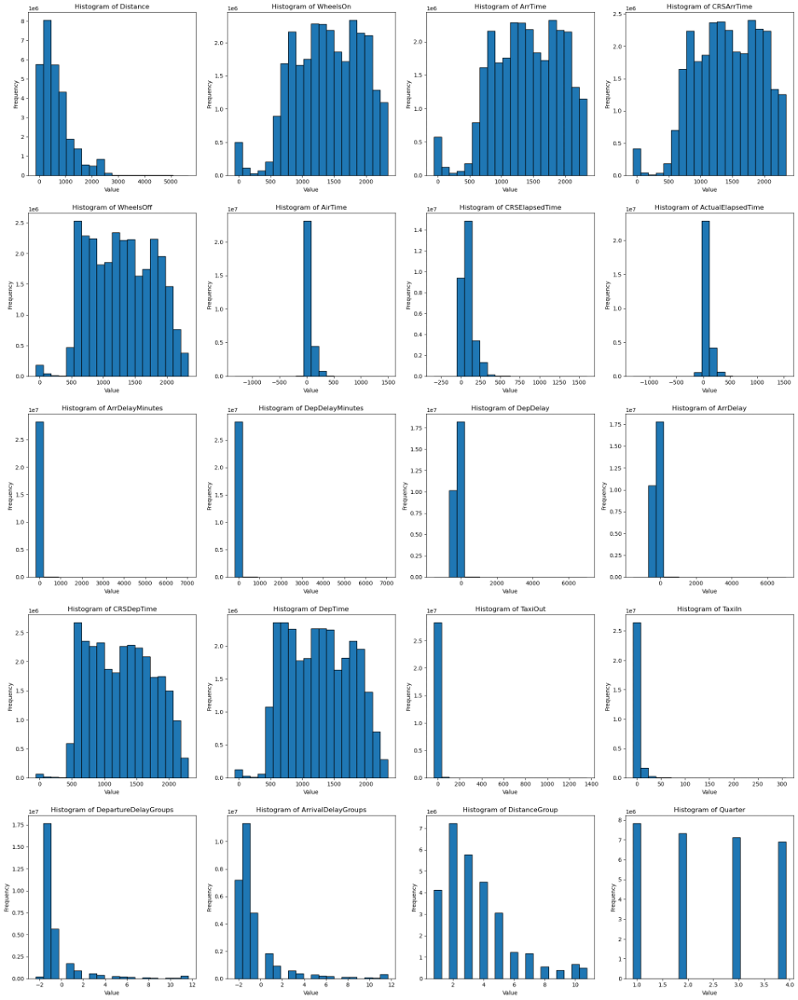
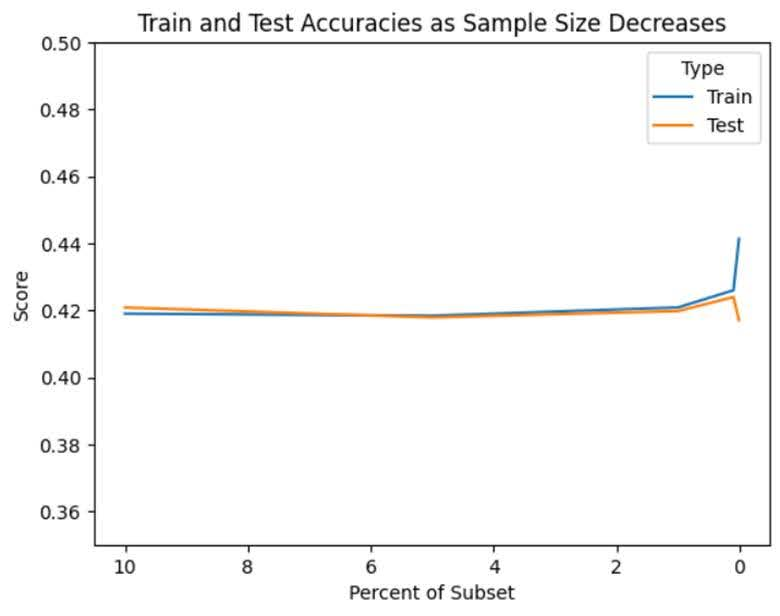
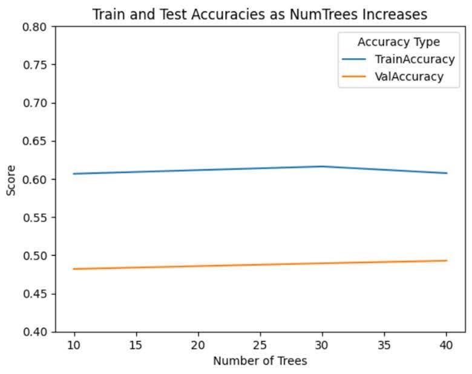
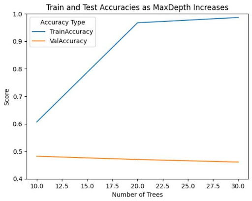
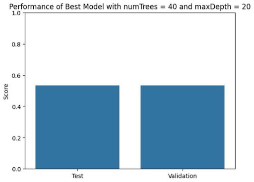

# Dataset

**Our data set can be found here: [Flight Status Prediction](https://www.kaggle.com/datasets/robikscube/flight-delay-dataset-20182022)**

# Data Preprocessing - Milestone 2

Before conducting any in-depth analysis or modeling, it's essential to preprocess the data to ensure consistency, reliability, and usability. Our preprocessing workflow involves the following steps:

## Preprocessing Steps Taken in This Notebook

For the purposes of this milestone, we have conducted in-depth analyses of our data and performed several preprocessing steps to prepare the dataset for subsequent milestones.

### 1. Data Exploration

- **Feature Exploration:** We began the exploration process by presenting the schema of our DataFrame, displaying the column names, data types, and nullability.
- **Dataset Shape:** After loading the data and reviewing the feature schemas, we identified the dataset dimensions: 29,193,782 rows by 120 columns.
- **Null Values:** Columns with more than 10% missing values were dropped. For others, we plan to apply imputation using either the mean or median, depending on which results in the lowest RMSE during testing.
- **Outliers:** Outliers will be handled using statistical methods appropriate to each feature's distribution. Initial distribution analysis is covered in the next section.

### 2. Dataset Statistics and Distributions

- **Statistical Summary:** For each numerical feature, we examined the following statistics: count, mean, standard deviation, minimum, maximum, and the 25th, 50th (median), and 75th percentiles.
- **Data Distributions:** To visualize the data and identify potential outliers, we calculated skewness and plotted histograms for the 20 most skewed features.

### 3. Data Visualization

- **Questions and Corresponding Plots:** We posed several analytical questions related to flight delays and visualized relevant features to explore potential insights. Each question is accompanied by a corresponding plot and a brief discussion. This exploratory step is crucial for identifying useful features and will aid in our final feature selection process.

## Preprocessing Steps for the Future

As our objectives become more refined and our understanding of the data improves, the preprocessing steps outlined above may need to be expanded. Below are potential future enhancements:

### 1. Data Transformation

- **Standardization/Normalization:** We plan to standardize or normalize numerical features to ensure consistent scaling, particularly for models sensitive to feature magnitudes. At this stage, no features appear to require it, but we will revisit this as needed.
- **Unit Conversion:** For example, to compute average speed (in miles/hour), we will convert elapsed time to hours and divide the distance by this value.

### 2. Feature Engineering

- **New Features:** We plan to create additional variables that could enhance analysis or modeling. For instance, `speed = distance / elapsed_time`.
- **Categorical Encoding:** Any categorical features will be encoded using one-hot or label encoding to ensure compatibility with machine learning models such as random forests.

### 3. Data Integration & Reduction

- **External Data:** If useful, we may incorporate external datasets (e.g., city coordinates for geospatial analysis).
- **Dimensionality Reduction:** Techniques such as PCA or feature aggregation will be explored to reduce dimensionality and improve model performance.

## Jupyter Notebook

The full preprocessing pipeline can be found in [GroupProject.ipynb](./notebooks/GroupProject.ipynb).

# Model Generation - Milestone 3

## 1. PreProcessing Finalization

- **Removal of Redundant Features:** columns deemed to have unnecessary information or information covered by other features were removed leaving 31 remaining features.
- **Handling Missing Data:** to account for the vast majority of missing data, entries with cancelled flights were removed resulting in only 0.27% of observations having null values. These rows were subsequently removed.

## 2. Feature Expansions

- **Route Column:** this new feature combines information from 'Origin' and 'Dest' to make a route identifier.
- **Speed Column:** this feature takes the ratio of 'AirTime' and 'Distance' to get the average speed during the flight.
- **Route Visualization:** for visualization purposes, we created an interactive map of the U.S. that includes the top 1000 most popular routes.

## 3. Model Creation

- **Model Selection:** a RandomForest classifier was selected to be our first model
- **String Indexing:** after preprocessing and feature expansion, there were 12 columns that needed to be converted from strings to doubles. Two of these new indices resulted in too many distinct categories and were therefore removed.
- **Label Column Reduction:** initially, there were 16 label categories. We reduced this to 4 and balanced the category counts as best as possible,
- **Dataset Split:** this dataset was split into smaller training, validation, and testing datasets (70/15/15 respectively).

## 4. Model Evaluation

- **Accuracy Scores:** the trained model was used to predict scores resulting in training and testing accuracies of around 42%
- **Importance Scores:** we used the gini importance metric to see what impact our features had on the model

## 5. Conclusion
- Our initial model provides a solid baseline, but its moderate accuracy suggests potential underfitting or label noise.

- Future work will include:

  - Exploring other model types (e.g., XGBoost, Gradient Boosted Trees)

  - Hyperparameter tuning

  - Further refining the label categories and applying SMOTE or other balancing techniques
 
**For our full code and detailed outputs, see our main notebook [GroupProject.ipynb](./notebooks/GroupProject.ipynb).**


---
# Model Optimization and Final Submission - Milestone 4
## Abstract 
We aim to analyze a dataset of approximately 30 million U.S. domestic flights from 2018 to 2022 - around 11GB in size - to understand the key factors contributing to flight delays. The dataset includes features such as scheduled and actual departure/arrival times, delay durations, and reasons for delays or cancellations. Our approach will involve comparing two methods - feature selection using random forest and feature distribution through unsupervised clustering - to identify the most significant factors influencing flight delays. The ultimate goal is to extract insights that can be used to predict flight delay statuses. Given the dataset’s large size (29 million rows and 120 columns), we will leverage PySpark for efficient data processing.

## Introduction

Modern transportation has significantly evolved, ranging from walking and horse-drawn carriages to advanced systems such as cars, buses, subways, and airplanes. Among these, air travel stands out due to its speed, convenience, and the ability to bridge large distances quickly. Accurate travel planning, including precise departure and arrival times, is crucial in our fast-paced world, as delays can result in lost productivity, increased stress, and disrupted schedules. In 2023 alone, over 2.6 billion passengers used domestic air travel in the U.S., emphasizing the scale and impact of delays.

We selected the U.S. Domestic Flights Delay dataset (2018-2022) from Kaggle due to its extensive coverage, containing roughly 30 million records detailing various factors associated with flight scheduling and delays. This comprehensive dataset provides rich insights into scheduled versus actual departure and arrival times, delay durations, and specific reasons for cancellations or delays. Our goal is to identify and analyze the most influential factors leading to delays by applying advanced data analysis techniques, specifically feature selection through random forest and feature distribution via unsupervised clustering.

By effectively predicting flight delays, travelers, airlines, and airport authorities can proactively manage disruptions, significantly improving passenger satisfaction, reducing operational costs, and enhancing overall efficiency. Ultimately, our analysis aims to deliver valuable insights that can facilitate better planning, optimize time usage, and positively influence millions of travelers each year.

## Methods

**** Hailey Start
### 1. Data Exploration
- Evaluated null value abundance across all features.
- Features with >10% null values were excluded.
- Assessed distribution and summary statistics for each feature.
- Identified skewed distributions to inform preprocessing steps.
```py
# Finding stats
for col_name in cont_cols:
    q1, median, q3 = filtered_df.approxQuantile(col_name, [0.25, 0.5, 0.75], 0.01)
    stats["25%"][col_name] = str(q1)
    stats["50%"][col_name] = str(median)
    stats["75%"][col_name] = str(q3)

# Removing Null Values
columns_above_90 = [col_name for col_name, pct in non_null_percentages.items() if pct >= 90]
filtered_df = df.select(columns_above_90)

# Managing skewed data
# build rows of (column, absolute_diff, skew direction)
result_rows = []
for c in cols: # for each col
    mean_val = float(mean_row[c]) # get mean
    median_val = float(median_row[c]) # get median
    diff = __builtins__.abs(mean_val - median_val) # get abs difference
    skew = "right" if mean_val > median_val else "left" if mean_val < median_val else "none" # get skew direction
    result_rows.append(Row(column=c, absolute_diff=diff, skew=skew)) # aggregate
```

### 2. Preprocessing
- Removed redundant features.
- Excluded cancelled flights to focus on factors predictive of flight delay duration.
Feature Engineering:
- Created new feature Route by combining Origin and Dest.
- Generated ratio feature: AirTime / Distance.
- Applied log transformation to skewed numeric features (e.g., Distance with >3× skew).
- Indexed categorical variables for ML compatibility.
- Created multiclass label by binning delay durations into 4 categories.
```py
# Creating new features
filtered_df = filtered_df.withColumn(
    "route",
    F.concat_ws(
        " - ",
        F.coalesce(F.col("Origin"), F.lit("Unknown")),
        F.coalesce(F.col("Dest"), F.lit("Unknown"))
    )
)

filtered_df = filtered_df.withColumn(
    "avg_speed_mph",
    F.when(
        F.col("AirTime").isNotNull() & (F.col("AirTime") != 0),
        F.round((F.col("Distance") / F.col("AirTime")) * 60)
    ).otherwise(None)
)

```


### 3. Model 1: Random Forest Classifier
- Trained a Random Forest model to predict delay duration category.
- Used feature importance scores to identify the most influential predictors.
- Preliminary hyperparemeter tuning done by measuring accuracy when varying `numTrees` and `maxDepth`.
- Further hyperparameter tuning via a validation dataset was planned if SDSC resources were available.
```py

# assemble features
assembler = VectorAssembler(inputCols=feature_cols, outputCol="features")
# Generate random forest model
rf = RandomForestClassifier(labelCol="ArrivalDelayGroups", featuresCol="features", seed=42, maxBins=800, numTrees = 5, maxDepth = 3)

...
# Feature importance
rf_model = model.stages[-1]  # assuming RF is the last stage
importances = rf_model.featureImportances
feature_names = assembler.getInputCols()

importances_list = list(zip(feature_names, importances.toArray()))
importances_sorted = sorted(importances_list, key=lambda x: x[1], reverse=True)

print("Feature Importances from RF Gini Importance:\n")
for feat, score in importances_sorted:
    print(f"{feat}: {score:.4f}")
```

### 4. Model 2: K-Means Clustering (Planned if SDSC resources were available) 
- Fit K-Means on the Feature Matrix
- Apply K-Means to the preprocessed data (excluding the target/label column).
- Choose k based on the elbow method or aligned with the number of delay categories (e.g., 4 clusters for 4 delay duration classes).
- analyze cluster composition by assigning the original delay labels back to each sample after clustering.
- calculate label proportions in each cluster to identify which clusters are enriched for high-delay flights.
- Compare feature distributions by cluster. For each feature, plot a heatmap to compare how feature values differ between clusters.
- Rank features by cluster separation (ANOVA F-value?) to help quantify how strongly a feature is driving cluster formation - how it relates to delay outcomes. 

5. Model 1 & 2 comparisons (Planned if SDSC resources were available)
- Features with highest Gini scores were to be compared to high ranked features by clustering.
- Potential interpretations: features that are top-ranked in both models are likely truly important for explaining flight delay. If a feature is ranked highly in clustering but not random forest, it might be associated with delay patterns that the model didn't learn well — useful for model refinement or domain insights.

**** Ahyo Start (if needed)
Enter text here...

**** Ahyo End

**** Nam start
Enter text here...


**** Name end


**** Rita Start
Enter text here...


**** Rita End


## Results:
This will include the results from the methods listed above (C). You will have figures here about your results as well.
- No exploration of results is done here. This is mainly just a summary of your results. The sub-sections will be the same as the sections in your methods section.
- Your final model and final results summary will go in the last paragraph.

**** Rita Start
### 1. Data Exploration
Our unfiltered dataset had a shape of 29193782 rows and 120 columns. In the initial data exploration, we chose to remove the columns that more than 10% of null values, leaving us with 62 columns out of the original 120 columns to work with. After removing these columns, we decided to explore the top 20 most skewed columns as seen below. Most of which are skewed right, aside from WheelsOn, ArrTime, and CRSArrTime, which are skewed left. 



### 2. Preprocessing 
We decided to remove columns we thought to be redundant for analysis or were related to other columns. For instance, we removed FlightDate because of the Year, Month, and DayofWeek columns. For missing data, columns with more than 10% of null values were excluded from our analysis. Columns that had 1-3% of msising values were Tail_Number, DepTime, DepDelay, DepDelayMinutes, DepDel15, DepartureDelayGroups, WheelsOff, TaxiOut, ArrTime, WheelsOn, TaxiIn, ActualElapsedTime, ArrDelay, ArrDelayMinutes, ArrDel15,  ArrivalDelayGroups, and AirTime. Their missing values were handled by just removing the missing rows. 

For feature expansion, Route was created by combining the Origin and Dest columns. Avg_speed_mph (Distance/AirTime * 60) and num_flights (the count of each route) were created to aid in model performance. Categorical variables were indexed using StringIndexer to convert them to numeric values to be used in the Random Forest model.

### 3. Model 1: Random Forest Classifier
Our first model yielded an accuracy score of ~42% for both the training and test data. Overfitting was not strongly observed, as both training and test accuracies were similar. The most influential features were TaxiOut and ArrTime, both of which are likely indicators of delay and are available before the flight departs. The model's accuracy was below our expectations, and further optimizations and alternative models such as XGBoost were planned to improve performance.


**** Rita End

#### Preliminary Hyperparameter tuning
Despite not being able to fully optimize our model, we did take some preliminary steps by tuning parameters. The results of this process are given by the images below:

**Decreasing Sample Size**



To check the stability of our model, we measured the effect on training and testing accuracy as the sample size was significantly decreased. As can be seen from the plot above, decreasing the sample size did not result in any meaningful changes to accuracy, suggesting that our model is relatively stable. This further allows us to use a much smaller subset of the data for hyper parameter tuning, before eventually scaling back to size. For tuning, we use 0.1% of the data. At this split, accuracy remains the same, but memory usage is greatly improved.

**Increasing `numTrees`**



The first parameter tuned is NumTrees and the accuracy of the model is measured with 10 trees, 30 trees, and 40 trees, while maintaining MaxDepth at 10. From the plot above, there is no discernable change in accuracy as this parameter is increased.

**Increasing `maxDepth`**



Next, we tune MaxDepth using 10, 20, and 30 for this parameter while keeping NumTrees at a constant 10. Here, we observe overfitting as the training accuracy greatly improves while validation accuracy slightly diminishes.

**Best Model Performance**



After tuning the parameters, the best model was found to have numTrees equal to 40 and a max depth of 20. Compared with our originally trained model, these parameters increased our test set accuracy by around 10%, resulting in a new accuracy of 52%. While this is a significant increase, and remains well above a model randomly guessing (25%), it still leaves a lot of room for improvement. Given more time and available resources, we would have continued to tune these parameters, feature engineer, and compare different machine learning methods.

Potential interpretations if both supervised and unsupervised models were able to be evaluated. Missing ranked features from unsupervised clustering, unable to complete this model without SDSC resources: 
- Supervised learning (Random Forest): - Used feature importance (Gini) scores to identify the most influential features for accurately predicting flight delay duration.
-  Unsupervised learning (K-Means): Rank features by cluster separation (ANOVA F-value?) to help quantify how strongly a feature is driving cluster formation - how it relates to delay outcomes.
- Comparison of top ranked features from both approaches: features that are top-ranked in both models are likely truly important for explaining flight delay.
- If a feature is ranked highly in clustering but not random forest, it might be associated with delay patterns that the model didn't learn well.


## Discussion:

This project aimed to utilize two distinct methods—Random Forest classification and K-Means clustering—to identify factors associated with flight delays. While both methods aimed to uncover relationships between features and flight delay durations, they operate on fundamentally different principles, making direct comparison both informative and limited.

Random Forest, a supervised learning algorithm, ranks features by their predictive power—specifically, how much each feature contributes to reducing impurity in classifying delay categories. This results in a quantitative feature importance score that highlights variables most useful for prediction, such as origin, distance, or taxi-out time.

In contrast, K-Means clustering is an unsupervised method that groups flights based on feature similarity, without reference to the actual delay categories. After clustering, we can examine the distribution of delay categories within each cluster and analyzed the underlying feature distributions. This approach identifies which feature values (not just features) are common in clusters enriched for each delay category. For example, a cluster characterized by longer delays might also have high values for taxi-out time and low values for flight distance.

Although both methods can highlight relevant features, they do so through different approaches:
- Random Forest emphasizes which features help a model distinguish between delay categories.
- K-Means emphasizes which feature values tend to group together in clusters associated with specific delay outcomes.

Despite these differences, the two methods offer complementary insights, features that are ranked highly by both methods (e.g., high Random Forest importance and distinct cluster patterns) provide strong evidence of their relevance to flight delays. Discrepancies between the two can guide further analysis—e.g., a feature important in clustering but not in RF may suggest a variable underrepresented in the model.

To further refine our predictive capability, we undertook extensive preprocessing and feature engineering. Initially, during data exploration, we identified and removed redundant and duplicate features to streamline the dataset and avoid overwhelming the models with unnecessary or noisy data. Recognizing that flight delays are influenced by numerous variables—including mechanical issues, passenger boarding/offboarding times, and weather disturbances—our dataset posed unique challenges, as some dynamic factors, like real-time weather conditions, were not directly captured. We addressed this by creating novel features, such as combining "Origin" and "Destination" into a unified "Route" feature and calculating ratios like AirTime-to-Distance to better encapsulate flight characteristics. These new derived features aimed to enhance the Random Forest model's predictive performance by providing clearer indicators of delay patterns and more informative inputs, ultimately supporting more accurate and robust predictions. 

We acknowledge that certain dynamic variables were unavailable or omitted during preprocessing, and crucial information may have been inadvertently removed. Our analysis specifically focused on departure delays; however, in practice, pilots often compensate for late departures by adjusting flight operations—such as optimizing climb and cruise speeds—when weather conditions permit, enabling on-time arrivals despite initial setbacks. In our case, it may be completely possible to predict if a plane would be delayed or not, but this does not necessarily correlate with arriving later than the scheduled arrival time. Investigating arrival delays would require a separate study and additional data processing beyond the scope of this project.


**** Rita Start
Enter text here...


**** Rita End

## Conclusion:
This is where you do a mind dump on your opinions and possible future directions. Basically what you wish you could have done differently. Here you close with final thoughts

**** Group Start
Enter text here...

**** Group end

## Collaboration:
This is a statement of contribution by each member. This will be taken into consideration when making the final grade for each member in the group. Did you work as a team? was there a team leader? project manager? coding? writer? etc. Please be truthful about this as this will determine individual grades in participation. There is no job that is better than the other. If you did no code but did the entire write up and gave feedback during the steps and collaborated then you would still get full credit. If you only coded but gave feedback on the write up and other things, then you still get full credit. If you managed everyone and the deadlines and setup meetings and communicated with teaching staff only then you get full credit. Every role is important as long as you collaborated and were integral to the completion of the project. If the person did nothing. they risk getting a big fat 0. Just like in any job, if you did nothing, you have the risk of getting fired. Teamwork is one of the most important qualities in industry and academia!!!
- Start with Name: Title: Contribution. If the person contributed nothing then just put in writing: Did not participate in the project.

1. **Ahyo:** *Coding/Management:* I set up initial communication through discord and email and helped organize meetings throughout the project. After selecting our dataset, I created the foundational notebook for us to use for the remainder. I aided in exploring the dataset through pyspark. Specifically, I developed several stacked barcharts showing flight departure delays grouped by origin airport, year, and month categorized as early, on time, or late. To preprocess the data, I, along with the rest of the team, wrote code to clean, feature engineer, and transform the dataset, preparing it for modeling. Finally, I was responsible for writing and organizing much of the README.md file that outlines this project.
2. **Hailey:** *Coder/Writer/Machine Learning lead:* I led the development of the machine learning strategy to assess factors contributing to flight delays, including proposing the use of Random Forest for feature selection and unsupervised clustering for distribution analysis, as I was most familiar with machine learning applications in the group. I designed the data preprocessing workflow, ensuring the dataset was cleaned, structured, and optimized for machine learning implementation using PySpark in which everyone contributed to coding a separate piece of the preprocessing steps. I also contributed to understanding data distributions, skews, and general statistics of the dataset features to set up the preprocessing workflow. 
3. **Mihir:** *Project Manager/Lead/Dev:* I contributed by creating document for setting up the local env for everyone to use. Set up github repo and managed the processes to do with SDLC. I contributed to helping set up the data and extracting it to being able to use it by everyone, and contributed to data engineering process for coding. My main focus was to make sure everyone was on same page about the project, and had effective communication and strategy for the project. This work easy to manage since everyone in the project was equally helpful and communicated with each other as needed. I maintained the Git repo and and Pull request members did to make sure no merge conflcits deleted work by others since I was the only member in group experienced in Git. 
4. **Nam:**
5. **Rita:** *Coder:* I aided in finding and selecting the dataset and exploring some of the dataset through PySpark. In milestone 2, I developed bar charts exploring the top 10 most delayed routes and the top 10 most delayed airlines. I also developed a scatterplot to explore if delayed flights and distance had any sort of correlation. In milestone 3, I assisted in selecting redundant columns in our dataset and removing them to make preprocessing run more smoothly and ensure that the model was not affected on irrelevant or highly correlated data.

